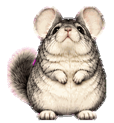
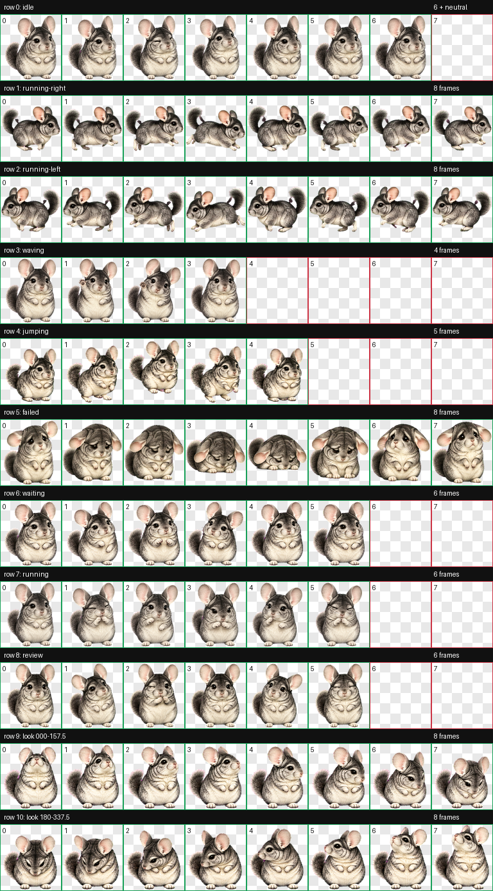

# Chinchilla for Codex

A custom chinchilla companion for the Codex desktop app, featuring nine animation states and 16 directional gaze poses. Built for the **v2 pet format**, with detailed fur, expressive ears, and a transparent sprite atlas.



## Features

- **Nine animation states** for idle, movement, greetings, jumping, and task activity.
- **16 gaze directions** arranged clockwise in 22.5-degree increments.
- **Transparent WebP artwork** with a consistent character silhouette and grounded stance.
- **Two-file installation** with no build step or additional dependencies.

## Installation

Requires a Codex desktop version that supports custom v2 pets. The instructions below use the default Windows configuration directory.

1. Download the repository using **Code → Download ZIP**, then extract it.
2. Back up any existing `%USERPROFILE%\.codex\pets\chinchilla` directory before replacing its contents.
3. Create that directory if needed, then copy `pet.json` and `spritesheet.webp` from the repository root into it.
4. Select **Chinchilla** in the Codex pet picker. Reopen the app if the updated pet does not appear.

The installed directory should contain:

```text
%USERPROFILE%\.codex\pets\chinchilla\
├── pet.json
└── spritesheet.webp
```

Only these two files are required. The `previews/` directory contains documentation assets.

To uninstall, remove the `chinchilla` directory. To restore an earlier version, replace it with your backup.

## Animation States

| State | Behavior | Frames |
| --- | --- | ---: |
| Idle | Subtle breathing and blinking | 6 |
| Running right | Rightward locomotion | 8 |
| Running left | Leftward locomotion | 8 |
| Waving | A raised-paw greeting | 4 |
| Jumping | Anticipation, lift, and landing | 5 |
| Failed | A subdued reaction to an error | 8 |
| Waiting | An attentive pose awaiting input or approval | 6 |
| Working | Focused task activity | 6 |
| Review | Attentive inspection | 6 |

Codex controls animation triggers and gaze selection. The preview GIF cycles through the gaze poses for demonstration; its playback speed does not represent the app's runtime behavior.

## Sprite Format

| Property | Value |
| --- | --- |
| Pet ID | `chinchilla` |
| Display name | `Chinchilla` |
| Sprite version | `2` |
| Image format | WebP with transparency |
| Atlas dimensions | 1536 × 2288 px |
| Grid | 8 columns × 11 rows |
| Cell dimensions | 192 × 208 px |
| Standard animations | Rows 0–8 |
| Directional gaze | Rows 9–10, 16 poses |

Gaze angles increase clockwise: **0° up**, **90° right**, **180° down**, and **270° left**. The number of gaze poses is separate from animation frame rate. Adding frames outside the v2 layout or changing the preview GIF does not change playback in Codex.

## Preview

<details>
<summary>View all animation states and gaze poses</summary>



</details>

## Asset Validation

The artwork was produced with image generation and assembled into the v2 atlas using deterministic image processing. The published package passed layout, transparency, and occupied-cell validation, followed by visual review of animation continuity and character consistency. Three independent reviewers also checked the gaze directions without angle labels.
